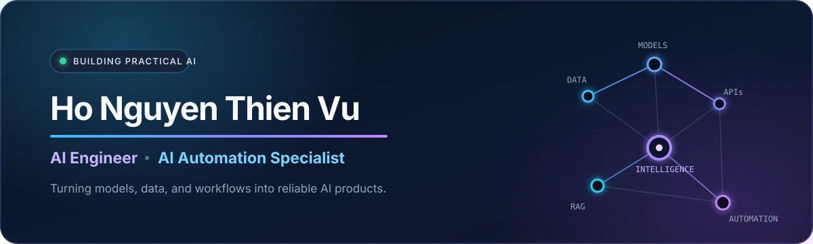

<div align="center">
  
</div>

<div align="center">
  <br />
  <strong>I turn operational bottlenecks into reliable AI systems and intelligent automation.</strong>
  <br /><br />
  <a href="https://www.linkedin.com/in/thiennvu1914"></a>
  <a href="https://aclanthology.org/2025.paclic-1.54/"></a>
  <a href="https://github.com/thiennvu1914?tab=repositories"></a>
</div>

## Profile

I am an **AI Engineer and AI Transformation Specialist** focused on bridging the gap between model development and production-ready deployment. I design AI-integrated automation solutions that connect business workflows, data, models, and software into dependable systems.

My work combines **AI engineering, workflow automation, data engineering, and backend development**. I care about more than making a model work: I focus on validation, observability, failure recovery, human review, and measurable operational value.

> **B.Sc. in Data Science** — University of Information Technology (UIT), VNU-HCM · 2026

## What I Do

<table>
  <tr>
    <td width="50%" valign="top">
      <h3>⚙️ AI Transformation & Automation</h3>
      <p>Map cross-department workflows and translate business requirements into practical AI-enabled systems.</p>
      <p><code>n8n</code> <code>REST APIs</code> <code>Webhooks</code> <code>OCR + LLM</code> <code>Human-in-the-loop</code></p>
    </td>
    <td width="50%" valign="top">
      <h3>🧠 NLP, LLMs & RAG</h3>
      <p>Build retrieval, reranking, fine-tuning, evaluation, and grounded-generation pipelines for Vietnamese-language applications.</p>
      <p><code>RAG</code> <code>PhoBERT</code> <code>Vistral-7B</code> <code>LoRA</code> <code>LLM Evaluation</code></p>
    </td>
  </tr>
  <tr>
    <td width="50%" valign="top">
      <h3>👁️ Computer Vision</h3>
      <p>Develop real-time detection and classification pipelines with efficient inference and change-aware processing.</p>
      <p><code>YOLOE</code> <code>MobileCLIP</code> <code>OpenCV</code> <code>SSIM</code> <code>Streaming</code></p>
    </td>
    <td width="50%" valign="top">
      <h3>🚀 AI Backend & Deployment</h3>
      <p>Deliver stable inference services, data pipelines, databases, and cross-system integrations from prototype to deployment.</p>
      <p><code>FastAPI</code> <code>Django</code> <code>PostgreSQL</code> <code>Docker</code> <code>Azure</code></p>
    </td>
  </tr>
</table>

## How I Build Reliable Automation

| 01 · Discover | 02 · Design | 03 · Integrate | 04 · Operate |
|---|---|---|---|
| Map the real workflow and identify bottlenecks | Define data contracts, decision logic, and review points | Connect APIs, OCR/LLMs, databases, and business systems | Add validation, retries, logging, monitoring, and human review |

This approach has been applied to operational workflows involving **purchase orders, delivery notes, invoices, inventory management, document processing, and data synchronization**.

## Professional Snapshot

- **AI Transformation Specialist** — designing and maintaining production workflows for cross-department operations.
- **AI Automation Engineer / Freelance Developer** — delivered private automation, document-processing, and data-pipeline solutions for real business use cases.
- **Artificial Intelligence Intern** — implemented AI components for enterprise use cases across dynamic pricing, LLMs, and computer vision.
- **Published Research Contributor** — data processing, backend/API development, evaluation, and manuscript contribution for a PACLIC 2025 paper.

## Featured Publication

### [Online Information Extraction System (EAOS) for Social Media Comments](https://aclanthology.org/2025.paclic-1.54/)

Published in the **Proceedings of the 39th Pacific Asia Conference on Language, Information and Computation (PACLIC 2025)**, Association for Computational Linguistics.

My contributions included data collection and processing, backend/API development, experimental evaluation, and manuscript writing.

## Selected Proof of Work

| Area | Evidence | Repository |
|---|---|---|
| Vietnamese NLP & LLM evaluation | Built **ViMUNCH**, an 8,501-example multitask benchmark evaluated across seven LLMs | [ViMUNCH](https://github.com/thiennvu1914/ViMUNCH-dataset) |
| Retrieval-Augmented Generation | Designed an end-to-end Vietnamese healthcare RAG pipeline over **138K+ localized medical records** | [V-MedRAG](https://github.com/thiennvu1914/Healthcare_Recommendation_System) |
| Real-time computer vision | Reduced unnecessary detector calls by **90–95%** using SSIM and frame-difference change detection | [Food Recognition](https://github.com/thiennvu1914/Automatic_Food_Recognition_and_Billing_System) |
| Legal-domain data engineering | Curated a balanced Vietnamese NLI dataset with **9,696 pairs across 26 legal aspects** | [ViLegalNLI](https://github.com/thiennvu1914/ViLegalNLI-dataset) |

## Technical Toolkit

| Focus | Technologies |
|---|---|
| **AI & ML** | PyTorch, TensorFlow, scikit-learn, Hugging Face, RAG, LoRA, model evaluation |
| **Automation** | n8n, REST APIs, Webhooks, OCR/LLM extraction, human-in-the-loop workflows |
| **Backend** | Python, JavaScript, FastAPI, Django, Streamlit, WebSocket |
| **Data** | PostgreSQL, MySQL, SQL Server, SQLite, HNSW, Kafka, ETL, web scraping |
| **Delivery** | Docker, Azure, Git/GitHub; familiarity with AWS, Kubernetes, MLflow, RabbitMQ, and CI/CD |

## Engineering Principles

```text
Business value  ·  Reliable systems  ·  Honest evaluation  ·  Human oversight  ·  Maintainable delivery
```

<div align="center">
  <h3>Let's build AI that works beyond the demo.</h3>
  <a href="https://www.linkedin.com/in/thiennvu1914">Connect with me on LinkedIn</a>
  &nbsp;·&nbsp;
  <a href="https://github.com/thiennvu1914">Explore my work on GitHub</a>
</div>
